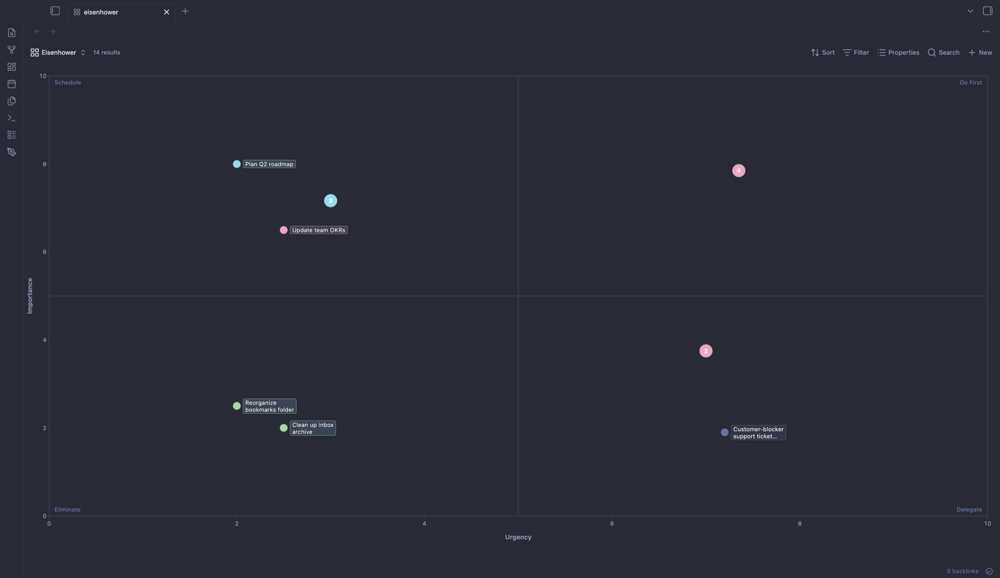
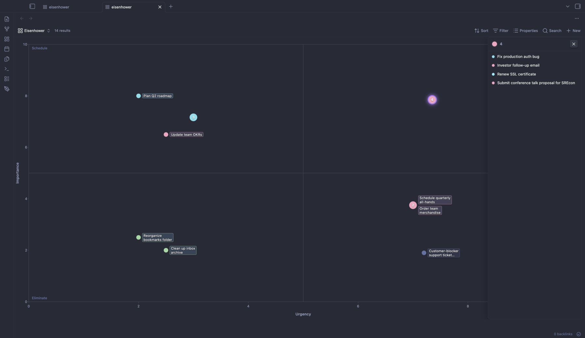

# 2×2 Matrix for Bases

A **2D scatter view** for [Obsidian Bases](https://help.obsidian.md/bases). Plot any filtered set of notes on a configurable plot using two numeric, date, or time frontmatter properties — with an optional quadrant overlay turning it into a 2×2 prioritization matrix.

Use it as:

- An **Eisenhower matrix** (urgency × importance) for prioritization
- A **2×2 strategic matrix** — effort/value, impact/effort, RICE, etc.
- A **tech radar** — 4 quadrants × 4 concentric rings (Adopt → Trial → Assess → Hold), ThoughtWorks-style
- A **trend / correlation scatter** (turn quadrants off) — for tracking a measurement over time or surfacing a relationship between two variables





## Features

- **Plot any filtered set of notes** as points using two numeric frontmatter properties
- **Drag points or their labels** to update both axis values in frontmatter at once
- **Click a point** to open an inline detail modal — the full Obsidian editor (properties panel + body) embedded, no leaving the chart context
- **Click any axis, quadrant, or ring label** to inline-edit it; persists to the `.base` file
- **Optional concentric-ring overlay** for tech-radar-style charts (`showRings: true` with `ring1Label`…`ring4Label`) — combines with the quadrant overlay so quadrant = sector, ring = adoption level
- **Smart clustering**: overlapping points fuse into one glyph with a count badge. Tap to open a tray listing all members; long-press a row to drag that member out of the cluster
- **Drag whole clusters** as a unit by grabbing the cluster mark
- **Snap to coordinates**: when a dragged dot lands near another point, their coordinates align exactly so the cluster forms consistently across devices
- **Bases-native integration**: +New creates a note pre-placed at chart midpoint; the Properties panel controls which chips appear in the per-point tooltip
- **Auto-flip labels** that would overlap another point or run past the plot edge
- **Optional color and size encoding** via additional properties
- **Mobile-ready**: tested on iPhone Safari with touch-action coordination, finger-offset drag, and adaptive layout for narrow viewports

## Try the examples

Three self-contained demos in the `examples/` folder. Drop any into a vault and open the `.base` file — no other setup.

- **[`examples/eisenhower/`](./examples/eisenhower/)** — 14 sample TODOs in the **2×2 matrix** configuration (urgency × importance, with quadrants and clusters). Includes clusters of 4, 3, and 2 overlapping points so you immediately see the tray and drag-out behavior. Optional Linear-style CSS snippet.
- **[`examples/tech-radar/`](./examples/tech-radar/)** — 23 technologies on a **ThoughtWorks-style tech radar**: 4 quadrants (Tools / Techniques / Platforms / Languages & Frameworks) × 4 concentric rings (Adopt → Trial → Assess → Hold). Drag a technology between rings as your assessment changes.
- **[`examples/training-log/`](./examples/training-log/)** — a year of 5K time trials in the **trend scatter** configuration (`showQuadrants: false`). Plot `week × 5K_time` to surface the year's training narrative: out-of-shape start, plateau, heat slowdown, sub-25 breakthrough, injury setback, year-end PB. Shows what the plugin is good for when the axes are continuous and quadrants would impose false categories.

## Install

### Via BRAT (recommended pre-release)

[BRAT](https://github.com/TfTHacker/obsidian42-brat) is the standard way to install Obsidian plugins not yet in the community store.

1. Install **Obsidian42 - BRAT** from the community plugins browser
2. In BRAT settings, **Add Beta Plugin** and paste:
   `https://github.com/pandysp/obsidian-bases-matrix`
3. Enable the plugin in Settings → Community plugins

BRAT will auto-update the plugin when new releases are tagged.

### Manual install

```bash
git clone https://github.com/pandysp/obsidian-bases-matrix
cd obsidian-bases-matrix
npm install
npm run build
```

Then copy `main.js`, `manifest.json`, and `styles.css` into `<your-vault>/.obsidian/plugins/bases-matrix/` and enable the plugin.

## Quick start

Given a folder of task notes with `urgency` and `importance` frontmatter properties (0–10 scale), drop this `.base` file in your vault:

```yaml
filters:
  and:
    - file.folder == "notes/todos"
    - file.ext == "md"
views:
  - type: matrix
    name: Eisenhower
    xAxis: note.urgency
    yAxis: note.importance
    colorBy: note.area
    xLabel: Urgency
    yLabel: Importance
    xMin: 0
    xMax: 10
    yMin: 0
    yMax: 10
    showQuadrants: true
    quadrantLabelQ1: Do First
    quadrantLabelQ2: Schedule
    quadrantLabelQ3: Eliminate
    quadrantLabelQ4: Delegate
```

Quadrant naming convention (clockwise from top-right):

- **Q1** — high X, high Y (top-right)
- **Q2** — low X, high Y (top-left)
- **Q3** — low X, low Y (bottom-left)
- **Q4** — high X, low Y (bottom-right)

For a trend / correlation scatter without the 2×2 framing, set `showQuadrants: false` — useful when the axes are continuous and quadrants would impose false categories (see the `training-log/` example).

## Configuration

All view options are available via the Bases sidebar (right side of any base file). For per-vault customization, edit the `.base` YAML directly.

| Key | Type | Default | Notes |
|---|---|---|---|
| `xAxis` | property | required | X-axis source (numeric, ISO date `YYYY-MM-DD`, or time `MM:SS` / `HH:MM:SS`) |
| `yAxis` | property | required | Y-axis source (same parseable types as `xAxis`) |
| `colorBy` | property | optional | Property for color encoding (categorical or numeric/gradient — see `colorScale`) |
| `colorScale` | enum | auto | `null` auto-detects (all-numeric → gradient, else categorical); `"categorical"` forces discrete; `"red-yellow-green"`, `"viridis"`, `"red-white-blue"` force gradient |
| `colorDirection` | enum | `high-is-good` | For diverging gradients, which end is "good". Flip to `"low-is-good"` for times, error counts, costs |
| `sizeBy` | property | optional | Numeric property for size encoding (normalized to dataset's min/max) |
| `xMin`, `xMax`, `yMin`, `yMax` | number | 0–10 | Fixed axis range |
| `xLabel` | text | `X-axis` | X-axis label (click to inline-edit on the chart) |
| `yLabel` | text | `Y-axis` | Y-axis label (click to inline-edit) |
| `showQuadrants` | toggle | true | Draw quadrant dividers + corner labels |
| `quadrantLabelQ1..Q4` | text | `Quadrant A`–`Quadrant D` | Per-corner labels (click to inline-edit) |
| `showRings` | toggle | false | Draw 4 concentric rings centered on plot midpoint (tech-radar overlay; combines with quadrants) |
| `ring1Label..ring4Label` | text | empty | Per-ring labels innermost to outermost (e.g. Adopt, Trial, Assess, Hold). Click to inline-edit |
| `centerAxes` | toggle | false | Draw the axes (and tick numbers) through the plot midpoint instead of along the frame edges. Math-plot / radar style |
| `showFrame` | toggle | true | Rectangular border around the plot area. Set false for math-plot or tech-radar styles where axes/rings carry the bounding |
| `showAxes` | toggle | true | Master toggle for axis chrome: divider lines, ticks, tick number labels. Set false for pure-radar layouts |
| `squarePlot` | toggle | false | Force a 1:1 aspect ratio. Useful when rings should render as true circles |
| `pointRadius` | slider | 8 | Base point size in pixels |
| `showLabels` | toggle | true | Always-on point labels |
| `labelMaxLength` | slider | 32 | Per-line character budget for two-line label wrapping |
| `newItemFilenamePattern` | text | optional | Custom basename for `+New` instead of Obsidian's `Untitled`. Supports a `{N}` token that resolves to the next integer making the filename unique in the target folder (e.g. `TODO-{N}` → `TODO-15`) |

## Overlapping points (clustering)

When two or more notes share the same coordinates, they fuse into one cluster glyph — a palette-colored circle with the member count.

**Open the tray**: tap (or click) the cluster glyph. An HTML overlay opens listing every member with its color dot and title. Tap a row to open that note's detail modal.

**Drag a cluster**: grab the cluster mark itself — all members move together. On release, the cluster lands at the new position with all members at identical coordinates.

**Drag out of a cluster**: long-press a row in the open tray; the row lifts and you can drag it onto the chart as a ghost dot. On release, the cluster re-forms with one fewer member (or dissolves to a singleton if only one is left).

The cluster glyph is colored using the most-common color among its members.

## How it integrates with Bases

- **Sort, Filter, Properties, +New** in the toolbar all work the same as other Bases views
- **+New** creates the file via Obsidian's standard flow but pre-sets x/y axis frontmatter to the midpoint of their configured ranges, so the new note appears on-chart from the start
- **Property chips on hover** (desktop only): any property you toggle on in the Properties menu appears as a chip in the per-point tooltip — same chip vocabulary as base-board cards

## Theming hooks

The plugin ships theme-token-driven defaults that look clean in any Obsidian theme. Domain-specific styling (your colors, fonts, pill shapes) belongs in user CSS snippets.

**Points and labels**
- `.matrix-point`, `.matrix-point-label`, `.matrix-point-group`
- `.matrix-axis-label`, `.matrix-quadrant-label`
- `.matrix-axis-line`, `.matrix-quadrant-divider`, `.matrix-tick`, `.matrix-tick-label`

**Clusters**
- `.matrix-cluster-group`, `.matrix-cluster-group--large`, `.matrix-cluster-group--expanded`, `.matrix-cluster-group--dragging`
- `.matrix-cluster-mark`, `.matrix-cluster-count`

**Cluster tray** (HTML overlay opened on tap of a cluster)
- `.matrix-cluster-tray`, `.matrix-cluster-tray--open`, `.matrix-cluster-tray--dragging`, `.matrix-cluster-tray--resizing`
- `.matrix-cluster-tray-header`, `.matrix-cluster-tray-mark`, `.matrix-cluster-tray-count`, `.matrix-cluster-tray-close`
- `.matrix-cluster-tray-list`, `.matrix-cluster-tray-row`, `.matrix-cluster-tray-row-dot`, `.matrix-cluster-tray-row-title`
- `.matrix-cluster-tray-row--lifted` (active drag-out state)

**Tooltip**
- `.matrix-tooltip` — root element
- `.matrix-tooltip[data-file-name]::before` — render basename as subtitle via `content: attr(data-file-name)`
- `.matrix-tooltip-chip[data-property-id="<property>"]` — style any property chip by its ID (e.g. `[data-property-id="file.ctime"]` for the timestamp chip)

The chip vocabulary intentionally matches base-board's so a single user snippet can style both views identically. See [`examples/eisenhower/linear.css`](./examples/eisenhower/linear.css) for a working Linear-flavored snippet.

## Mobile support

Verified on iPhone 16 Pro / Obsidian Mobile. Drag, tap-to-edit, cluster tray expand, long-press drag-out from the tray, and snap-to-coordinates all work via touch. Tooltips are suppressed on touch (no hover) — the inline detail modal is the touch-equivalent for property inspection. The tray flips to a bottom-sheet on narrow viewports with a draggable resize handle.

## Troubleshooting

**My points don't show up**
- Check that the configured `xAxis` and `yAxis` are numeric, ISO date (`YYYY-MM-DD`), or time (`MM:SS` or `HH:MM:SS`) frontmatter properties. Plain text and formulas without one of those shapes won't plot
- The chart shows a "N notes skipped" notice in the bottom-right if any notes are missing parseable values for the axes

**Drag commits the wrong value**
- Drag rounds to a precision based on axis range (0–1 → 2 decimals, 0–10 → 1 decimal, 0–100 → 0 decimals). If you need higher precision, expand the range
- When dragging onto another point within cluster-proximity, the dragged dot snaps to that point's exact coordinates so they cluster reliably

**Labels overlap awkwardly**
- The plugin auto-flips and shifts labels to avoid overlap, but extreme cases (many long labels at the same Y) may still leave residual crowding. Reduce `labelMaxLength` in the view config, or set `showLabels: false` for a cleaner mobile experience

## Development

### Live-inspecting plugin state

Obsidian is Electron, so its renderer is inspectable over the Chrome DevTools Protocol. For bugs that depend on runtime values Obsidian hands the plugin (Bases wrapper objects, computed bounds, type detection on live data), this is faster than scattering `console.log` calls or expanding objects manually in the dev console.

Quit Obsidian fully, then relaunch with CDP enabled:

```bash
/Applications/Obsidian.app/Contents/MacOS/Obsidian --remote-debugging-port=9222 &
```

Inspectable targets are listed at `http://localhost:9222/json/list` — the one named after your vault is the renderer.

Drive it from a terminal with Node 22+ (native `WebSocket`). Minimal helper that takes a `webSocketDebuggerUrl` and a JS expression, runs it in the live page context, and prints the result:

```js
// cdp-eval.mjs
const [, , wsUrl, expression] = process.argv;
const ws = new WebSocket(wsUrl);
ws.addEventListener("open", () => {
  ws.send(JSON.stringify({ id: 1, method: "Runtime.evaluate", params: {
    expression, returnByValue: true, awaitPromise: true,
  } }));
});
ws.addEventListener("message", (e) => {
  const m = JSON.parse(e.data);
  console.log(JSON.stringify(m.result?.result?.value ?? m, null, 2));
  ws.close();
});
```

Then poke arbitrary state — e.g., the shape of a Bases wrapper for a property:

```bash
WS=$(curl -s http://localhost:9222/json/list | jq -r \
  '.[] | select(.title | contains("your-vault")) | .webSocketDebuggerUrl' | head -1)

node cdp-eval.mjs "$WS" '
  const leaf = app.workspace.activeLeaf;
  const entry = Array.from(leaf.view.controller.queryState)[0];
  const v = entry.getValue("note.urgency");
  ({ typeof: typeof v, toString: String(v), constructor: v?.constructor?.name })
'
```

This is how the question-mark sentinel wrapper (`{ icon: "lucide-file-question", toString: () => "null" }`) was discovered — it isn't visible through the Obsidian CLI's `base:query` because the JSON serializer reduces wrappers to their `toString()` form, hiding the runtime shape.

### Building

```bash
npm install
npm run build
```

The build emits `main.js` next to `manifest.json` / `styles.css`. Copy all three into `<your-vault>/.obsidian/plugins/bases-matrix/` to test in place.

## Requirements

- Obsidian **1.10+** (Bases is a 1.10 feature)
- Works on **desktop and mobile**
- Designed for charts up to ~**150 points**; larger datasets work but re-render times grow quadratically

## License

MIT
